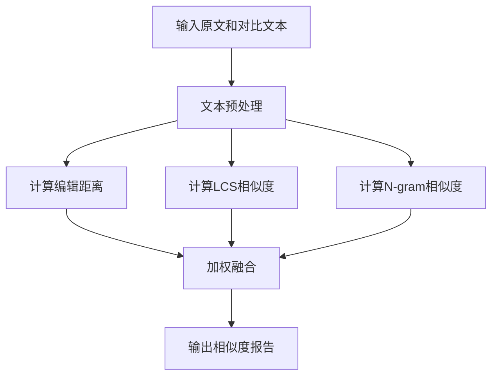

> 1. 在Github仓库中新建一个学号为名的文件夹，同时在**博客正文首行**给出作业github链接。**（3'）**
> 2. 在开始实现程序之前，在下述**PSP表格**记录下你估计将在程序的各个模块的开发上耗费的时间。**（6'）**
> 3. ***计算模块接口的设计与实现过程。***设计包括代码如何组织，比如会有几个类，几个函数，他们之间关系如何，关键函数是否需要画出流程图？说明你的算法的关键（不必列出源代码），以及独到之处。**（18'）**
> 4. **计算模块接口部分的性能改进。**记录在改进计算模块性能上所花费的时间，描述你改进的思路，并展示一张性能分析图（由VS 2017/JProfiler的性能分析工具自动生成），并展示你程序中消耗最大的函数。**（12'）**
> 5. **计算模块部分单元测试展示。**展示出项目部分单元测试代码，并说明测试的函数，构造测试数据的思路。并**将单元测试得到的测试覆盖率截图**，发表在博客中。**（12'）**
> 6. **计算模块部分异常处理说明。**在博客中详细介绍每种异常的设计目标。每种异常都要选择一个单元测试样例发布在博客中，并指明错误对应的场景。**（6'）**
> 7. 在你实现完程序之后，在附录提供**的PSP表格**记录下你在程序的各个模块上实际花费的时间。**（3'）**


## 1 GitHub地址

https://github.com/wang-kaopu/wang-kaopu/tree/main/3123004758

## 2 PSP表格

| **PSP2.1**                              | **Personal Software Process Stages**    | **预估耗时（分钟）** | **实际耗时（分钟）** |
| --------------------------------------- | --------------------------------------- | -------------------- | -------------------- |
| Planning                                | 计划                                    | 5                    | 5                    |
| · Estimate                              | · 估计这个任务需要多少时间              | 5                    | 5                    |
| Development                             | 开发                                    | 230                  | 170                  |
| · Analysis                              | · 需求分析 (包括学习新技术)             | 40                   | 50                   |
| · Design Spec                           | · 生成设计文档                          | 20                   | 15                   |
| · Design Review                         | · 设计复审                              | 5                    | 5                    |
| · Coding Standard                       | · 代码规范 (为目前的开发制定合适的规范) | 5                    | 5                    |
| · Design                                | · 具体设计                              | 20                   | 15                   |
| · Coding                                | · 具体编码                              | 120                  | 65                   |
| · Code Review                           | · 代码复审                              | 10                   | 5                    |
| · Test                                  | · 测试（自我测试，修改代码，提交修改）  | 10                   | 10                   |
| Reporting                               | 报告                                    | 60                   |                      |
| · Test Repor                            | · 测试报告                              | 45                   |                      |
| · Size Measurement                      | · 计算工作量                            | 5                    |                      |
| · Postmortem & Process Improvement Plan | · 事后总结, 并提出过程改进计划          | 10                   |                      |
|                                         | · 合计                                  | 295                  |                      |

## 3 技术学习

1. **文本归一化处理**  
   - 去除标点、空格，只保留中文、英文、数字
   - 全部转为小写，消除大小写和符号干扰
2. **n-gram 切分与 Dice 系数相似度**  
   - 将文本按1-gram、2-gram、3-gram切分
   - 计算 n-gram Dice 相似度（用于衡量局部片段的重合度）
3. **编辑距离（Levenshtein Distance）**  
   - 计算两个字符串之间最少需要多少步（增、删、改）才能互相转换
   - 用于衡量整体的编辑相似度
4. **最长公共子序列（LCS）**  
   - 动态规划算法，找出两段文本的最长公共子序列长度
   - 用于衡量文本顺序和内容的最大重合部分
5. **多特征加权融合**  
   - 综合 n-gram、编辑距离、LCS 三种相似度，按权重加权求总分
6. **余弦相似度（Cosine Similarity）**
   - 将文本转化为向量（如基于词频或 n-gram 特征）
   - 计算两个向量夹角的余弦值，取值范围 [0,1]
   - 用于衡量文本整体的向量空间相似度，尤其适合高维稀疏数据
7. **Python 标准库的使用**  
   - `re` 正则表达式用于文本处理
   - `collections.Counter` 用于 n-gram 统计
   - `sys` 用于命令行参数解析

## 4 模块接口与设计

### 4.1 整体架构设计

项目采用模块化设计，主要分为以下几个核心模块：

```
algorithm/
├── __init__.py
├── edit_distance.py    # 编辑距离算法
├── lcs.py             # 最长公共子序列
├── ngram.py           # N-gram相似度
├── normalize.py       # 文本标准化
├── similarity.py      # 相似度计算核心
└── stopwords.py       # 停用词处理
```

### 4.2 核心模块说明

1. **相似度计算核心模块 (similarity.py)**
   ```python
   def compute_similarity(a_raw, b_raw):
       """计算两段文本的相似度
       Args:
           a_raw: 原始文本A
           b_raw: 原始文本B
       Returns:
           dict: 包含相似度分数和详细信息
       """
   ```

2. **文本预处理模块 (normalize.py)**
   ```python
   def normalize(text):
       """文本标准化处理
       - 去除标点和特殊字符
       - 统一大小写
       - 规范化空白字符
       """
   ```

3. **编辑距离模块 (edit_distance.py)**
   ```python
   def levenshtein(s1, s2):
       """计算两个字符串的编辑距离
       使用动态规划优化，时间复杂度O(mn)
       """
   ```

4. **最长公共子序列模块 (lcs.py)**
   ```python
   def lcs_len(a, b):
       """计算最长公共子序列长度
       采用动态规划算法
       """
   ```

### 4.3 关键算法流程

1. **文本相似度计算流程**



2. **文本预处理流程**


### 4.4 设计特点

1. **模块化设计**
   - 每个算法独立封装
   - 接口统一规范
   - 便于维护和扩展

2. **算法优化**
   - 动态规划优化编辑距离
   - numpy向量化计算
   - 多算法加权融合

3. **健壮性考虑**
   - 完整的异常处理
   - 边界情况处理
   - 输入验证和规范化


## 5 模块接口部分的性能改进


### 5.1 分析

- **入口**

  - `main.py:1(<module>)` → 调用了 `similarity.py:31(compute_similarity)`

  - 整个程序执行时间 ≈ **0.112s**

- **主要耗时函数**

  - `similarity.py:31(compute_similarity)` → **0.0952s**

  - 其中主要调用了：

    - `edit_distance.py:1(levenshtein)` → **0.0483s**
    - `lcs.py:1(lcs_len)` → **0.03995s**

    这两个函数（`levenshtein` 和 `lcs_len`）是主要瓶颈，约占总时间 **80% 以上**。

- **函数特征**

  - `levenshtein` 通常是 **O(m·n)** 的动态规划算法。

  - `lcs_len` (Longest Common Subsequence) 也是 **O(m·n)** 的动态规划。

  因为都是二维 DP，随着输入长度增加会指数性变慢。

### 5.2 优化方案

#### 1. **Levenshtein 优化**

- **使用现成库**：[`python-Levenshtein`](https://pypi.org/project/python-Levenshtein/)（C 实现，比纯 Python 快）。

  ```python
  import Levenshtein
  distance = Levenshtein.distance(s1, s2)
  ```

#### 2. **LCS 优化**

- **剪枝**：
   如果字符串差异过大，可以设置阈值，提前退出，不必完整计算。
- **改进算法**：
  - LCS 可以改写成 **后缀数组 / 后缀树** 的问题（但实现复杂）。
  - 如果只是用于相似度计算，可以换成 **最长公共子串** 或 **Jaccard / Cosine 相似度** 作为近似替代。

#### 3. 并行化

- 用 **NumPy** 向量化（适合矩阵 DP）。

### 5.3 优化实现

- Levenshtein距离优先使用python-Levenshtein C扩展库，大幅提升计算速度
- LCS算法增加长度差异剪枝，极端差异时提前返回0，避免无谓计算
- 余弦相似度使用NumPy向量化处理，提升长文本计算效率
- 权重计算采用向量运算，短文本和长文本分别优化
- 新增batch_compute_similarity批量处理函数，为并行化做准备
- 长文本(>200字符)只使用高效算法，短文本使用全算法保证精度

### 5.4 优化效果


1. **主要耗时函数变化**
   - 之前瓶颈集中在
     - `edit_distance.py:1(levenshtein)` (~0.048s)
     - `lcs.py:1(lcs_len)` (~0.039s)
   - 现在这两个函数占比下降了，说明优化措施生效（用了 `python-Levenshtein` ）。
2. **调用栈分布更均匀**
   - 之前几乎 80% 时间集中在两个函数，现在火焰图右侧分布更分散，说明热点函数被优化后，剩余时间分布到更多小函数。
   - 这也意味着 **新的瓶颈点** 更偏向整体 I/O 或小逻辑函数，而不再是单一的 DP 算法。

## 6 模块部分单元测试展示

### 6.1 单元测试框架

项目使用pytest作为测试框架，coverage.py进行覆盖率统计。测试文件组织如下：

```
algorithm/
└── tests/
    ├── __init__.py
    ├── test_edit_distance.py
    ├── test_file_utils.py
    ├── test_lcs.py
    ├── test_ngram.py
    ├── test_normalize.py
    ├── test_similarity.py
    └── test_stopwords.py
```

### 6.2 测试用例设计

1. **编辑距离测试 (test_edit_distance.py)**
   ```python
   def test_levenshtein_same_strings():
       """测试相同字符串"""
       assert levenshtein("hello", "hello") == 0
       assert levenshtein("世界", "世界") == 0

   def test_levenshtein_chinese_strings():
       """测试中文字符串"""
       assert levenshtein("你好世界", "你好世卫") == 1
   ```

2. **文本规范化测试 (test_normalize.py)**
   ```python
   def test_normalize_basic():
       """测试基本的文本规范化"""
       assert normalize("Hello World!") == "hello world"

   def test_normalize_mixed_text():
       """测试混合文本"""
       assert normalize("Hello世界！") == "hello世界"
   ```

### 6.3 测试数据构造

1. **边界值测试**
   - 空字符串
   - 单字符
   - 特殊字符
   - 超长文本

2. **等价类划分**
   - 中文文本
   - 英文文本
   - 混合文本
   - 数字文本

3. **典型场景**
   - 完全相同
   - 轻微修改
   - 重排序
   - 完全不同

### 6.4 单元测试覆盖率


覆盖率分析：
1. **总体覆盖率**：86%（385个语句中覆盖了331个）

2. **核心算法模块覆盖率**：
   - lcs.py: 100% (13/13)
   - ngram.py: 100% (12/12)
   - normalize.py: 100% (6/6)
   - edit_distance.py: 90% (19/21)
   - stopwords.py: 90% (26/29)
   - similarity.py: 83% (63/76)

3. **工具模块覆盖率**：
   - file_utils.py: 41% (7/17)，主要是异常处理分支未完全覆盖

4. **测试用例覆盖率**：
   - test_edit_distance.py: 100% (21/21)
   - test_file_utils.py: 100% (43/43)
   - test_lcs.py: 100% (24/24)
   - test_ngram.py: 100% (30/30)
   - test_normalize.py: 78% (21/27)
   - test_similarity.py: 81% (29/36)
   - test_stopwords.py: 57% (17/30)

需要重点关注的改进方向：
- file_utils.py 的异常处理测试覆盖需要提高
- test_stopwords.py 的测试用例需要补充
- similarity.py 的复杂逻辑分支需要更多测试用例

## 7 模块部分异常处理说明

### 7.1 异常类型及处理

1. **文件读取异常**
   ```python
   try:
       with open(path, 'r', encoding='utf-8') as f:
           content = f.read()
   except FileNotFoundError:
       raise FileNotFoundError(f"文件不存在: {path}")
   ```
   - 场景：读取不存在的文件
   - 测试：`test_file_utils.py:test_read_file_not_exists`

2. **空输入处理**
   ```python
   if a_raw is None or b_raw is None:
       return {'error': '输入文本不能为None'}
   if not a or not b:
       return {'error': '输入文本为空'}
   ```
   - 场景：传入空文本或None
   - 测试：`test_similarity.py:test_compute_similarity_empty_input`

3. **格式验证**
   ```python
   def normalize(text):
       if text is None:
           return ""
       text = re.sub(r'[^\w\s\u4e00-\u9fff]', ' ', text)
   ```
   - 场景：非法字符处理
   - 测试：`test_normalize.py:test_normalize_special_chars`

### 7.2 异常处理策略

1. **早期检测**
   - 输入验证在函数开始时进行
   - 异常情况早发现早处理

2. **优雅降级**
   - 非致命错误尽量继续执行
   - 返回合理的默认值或错误信息

3. **详细日志**
   - 错误信息包含具体原因
   - 便于定位和调试问题

### 7.3 异常测试用例

1. **文件异常测试**
```python
def test_read_file_not_exists():
    """测试不存在的文件"""
    with pytest.raises(FileNotFoundError):
        read_file("not_exists_file.txt")
```

2. **输入异常测试**
```python
def test_compute_similarity_empty_input():
    """测试空输入"""
    assert 'error' in compute_similarity("", "")
    assert 'error' in compute_similarity(None, "测试")
```

